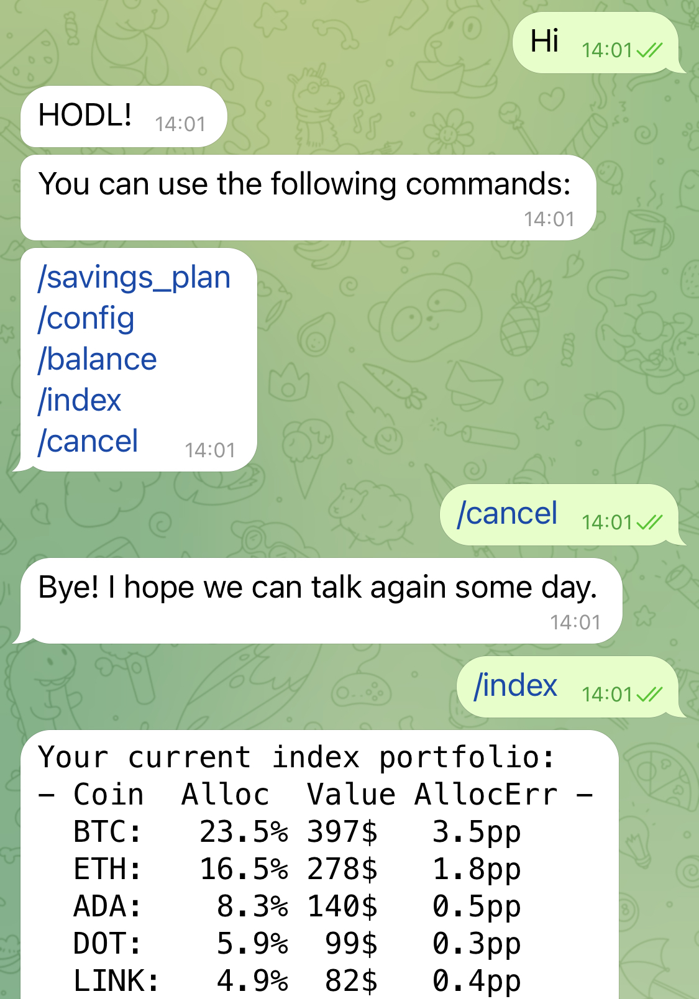
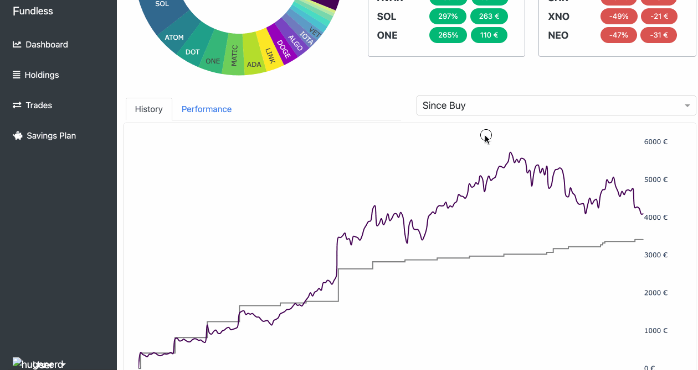

# FundLess
A crypto currency trading bot, that is aiming at a buy and hold strategy with marketcap weighted index-like portfolio and recurrent buys.

Interaction with the bot is done by Telegram, analytics on the bots performance is available via a web-based dashboard.

### Telegram Interface

### Dashboard

## Get Started
To get started you need to:
- create an API key on your favorite exchange
- talk to [BotFather](https://core.telegram.org/bots#6-botfather), to create your own Telegram bot
- get your personal telegram chat-id:
    1. just search for `@chatid_echo_bot` on telegram and type `/start`. It will echo your chat id
  
1. Copy the example files
    * `cp config.yaml_example config.yaml`
    * Choose one of the two authentication methods:
        * **Environment Variables (Recommended)**: 
            * `cp .env.example .env`
            * Fill in your API keys and secrets in the `.env` file
        * **YAML File (Legacy)**:
            * `cp secrets.yaml_example secrets.yaml`
            * Add your exchange API keys to `secrets.yaml`
2. Add your Telegram bot token and your personal telegram chat id to the chosen authentication method
3. Edit the `config.yaml` as you desire. The example config is configured to run with the Binance testnet API. You get some free test funds to play around with, when you create a [Binance testnet](https://testnet.binance.vision/) API key.
4. Run FundLess
    * **Pure Python:** Install the requirements from `requirements.txt` and run `main.py` from the projects root directory (`python3 fundless/main.py`)
    * **Docker** Run `docker-compose up` in the project directory.
      * If you want to leave FundLess running in the background, run `docker-compose up -d`

## Authentication Methods

### Environment Variables (Recommended)
FundLess can load all secrets and API keys from environment variables, which is the recommended approach for security. 

1. Copy the example .env file: `cp .env.example .env`
2. Fill in your API keys in the .env file
3. For multi-line secrets (like Coinbase EC private keys), paste the entire key including BEGIN/END markers as a single line

### YAML File (Legacy)
Alternatively, you can still use the legacy YAML file approach.

1. Copy the example secrets file: `cp secrets.yaml_example secrets.yaml`
2. Add your API keys to the secrets.yaml file
